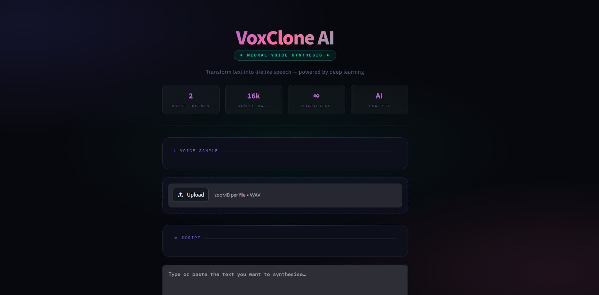

# VoxClone — AI Voice Cloning System

> Convert any text into speech that sounds like a specific person — powered by modern AI voice synthesis.



---

## What is VoxClone?

VoxClone is an AI-based voice generation system that lets you **convert text into speech using a target voice**. It covers both local text-to-speech synthesis and high-quality API-based voice generation, making it a great reference for understanding how modern voice cloning pipelines actually work.

---

## How It Works

A voice cloning system is built around three core components working in sequence:

### 1. Speaker Encoder
Takes a voice sample and extracts its unique characteristics into a compact numerical representation called a **speaker embedding** — essentially a fingerprint of how someone sounds.

### 2. Synthesizer
Combines the input text with the speaker embedding to produce a **mel spectrogram** — an intermediate visual representation of what the speech should sound like.

### 3. Vocoder
Converts the mel spectrogram into an actual **audio waveform** that can be played back.

**Full Pipeline:**
```
Voice Sample → Speaker Encoder → Speaker Embedding
Text + Embedding → Synthesizer → Mel Spectrogram
Mel Spectrogram → Vocoder → Generated Speech
```

**Example:** Given Dhruv's voice sample and the text *"Hello, I am learning AI"*, the system captures Dhruv's voice style and produces AI-generated speech that approximates how he would say that sentence.

---

## Features

| Feature | Description |
|---|---|
| **Basic TTS** | Local synthesis using SpeechT5 — fast and lightweight |
| **ElevenLabs Integration** | High-quality, realistic voice generation via API |
| **Streamlit App** | Clean UI to upload audio, enter text, and download output |

---

## Libraries Used

| Library | Purpose |
|---|---|
| `torch` | Deep learning framework for model inference |
| `torchaudio` | Audio processing with PyTorch |
| `librosa` | Audio loading, normalization, feature extraction |
| `soundfile` | Saving generated audio files |
| `spacy` | Text processing and NLP enhancements |
| `TTS` | Pretrained Text-to-Speech models |
| `tqdm` | Progress tracking during processing |

---

## Getting Started

**1. Clone the repository**
```bash
git clone https://github.com/your-username/VoxClone.git
cd VoxClone
```

**2. Create a virtual environment**
```bash
python -m venv venv
venv\Scripts\activate   # Windows
source venv/bin/activate  # macOS/Linux
```

**3. Install dependencies**
```bash
pip install -r requirements.txt
```

**4. Run the app**
```bash
python -m streamlit run app.py
```

---

## Usage

1. Upload a `.wav` audio file of the target voice
2. Enter the text you want to synthesize
3. Choose a mode — **Basic TTS** or **ElevenLabs**
4. Click **Generate Voice**
5. Download the output audio

---

## A Note on Training

This project uses **pretrained models** rather than training from scratch. Full training requires large, clean datasets, a GPU, and significant compute time. For reference, a basic training call would look like:

```python
from TTS.api import TTS

tts = TTS(model_name="tts_models/en/ljspeech/tacotron2-DDC")
tts.train(
    dataset_path="your_dataset",
    epochs=10,
    batch_size=16
)
```

Pretrained models are used here for faster development and practical results. For production-quality output, the ElevenLabs integration is recommended.

---

## Key Takeaways

- Voice cloning depends on well-aligned speaker embeddings and properly trained models
- Pretrained models offer speed and ease but have limitations in voice accuracy
- API-based solutions (like ElevenLabs) deliver production-level realism

---

Made with love by **Bit-Bard**
